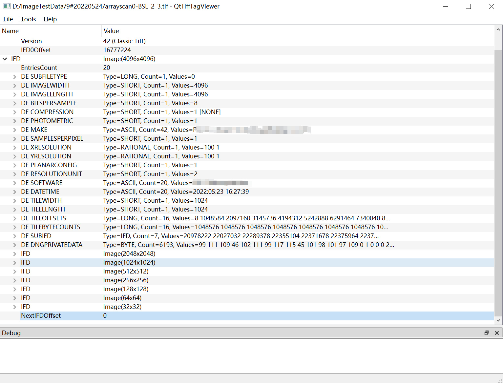

# QtTiffTagViewer

QtTiffTagViewer is not a tiff image file viewer.

QtTiffTagViewer is an application for viewing TIFF **tags**, which is written in C++ Qt. It allows you to easily view the TIFF tags of each Image File Directory (IFD).

This repository is used as a demonstration of how to make Qt work with GitHub Actions as well.

